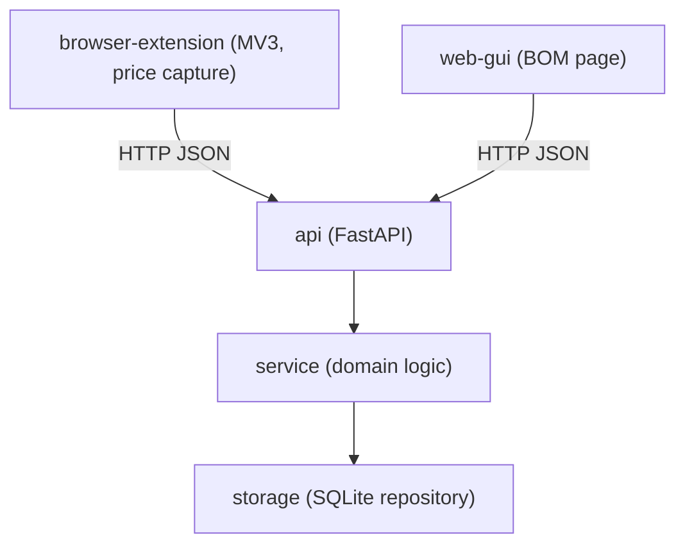

# Architecture — devis-bom

_Last updated: 2026-08-20 — requirement: BOM-UI-EXTENSION-001_

## Overview

`devis_bom` is a bill-of-materials and price-comparison tool, independent of
`ceiling_planner` (different domain, own FastAPI app, own database, no shared code). The user
enters a BOM as referenced lines (e.g. the components of an electrical panel quote), then
browses supplier sites and uses a companion browser extension to capture a price for a line
directly from the product page. The app matches each capture to a line by reference and
summarizes the cheapest price per line into an estimated total.

## Component Diagram

## Component Responsibilities

| Component | Responsibility | Requirement(s) |
|-----------|----------------|----------------|
| storage | Persist BOM lines and price captures in SQLite; match a capture to a line by reference | BOM-FUNC-LINES-001, BOM-FUNC-PRICES-001 |
| service | Enforce domain rules (unique reference, positive quantity/price, unknown-reference/unknown-line errors) and compute the cheapest-price summary | BOM-FUNC-LINES-001, BOM-FUNC-PRICES-001, BOM-FUNC-SUMMARY-001 |
| api | Expose `/api/lines`, `/api/prices`, `/api/summary` over HTTP with CORS open for the extension, and serve the BOM page | BOM-TECH-API-001, BOM-UI-PAGE-001 |
| web-gui | Self-contained page to add/remove BOM lines and review captured prices and the estimated total | BOM-UI-PAGE-001 |
| browser-extension | MV3 popup that extracts a candidate price from the active product page, lets the user pick the matching BOM line, and posts the capture to the API | BOM-UI-EXTENSION-001 |

## Dependency Injection Map

| Component | Receives | Interface | Requirement |
|-----------|----------|-----------|-------------|
| service | `BomRepository` | plain constructor parameter (no interface abstraction yet — one implementation exists) | BOM-FUNC-LINES-001 |
| api | `DevisBomService`, built from a `db_path` | `create_app(db_path)` factory, so tests inject a throwaway database | BOM-TECH-API-001 |

## Requirement → Component Traceability

| Requirement | Component(s) | Notes |
|-------------|-------------|-------|
| BOM-FUNC-LINES-001 | storage, service | unique-reference BOM lines |
| BOM-FUNC-PRICES-001 | storage, service | price capture matched by reference |
| BOM-FUNC-SUMMARY-001 | service | cheapest-price total and gap reporting |
| BOM-TECH-API-001 | api | `/api/lines`, `/api/prices`, `/api/summary`, CORS open for the extension |
| BOM-UI-PAGE-001 | web-gui, api | page served by api |
| BOM-UI-EXTENSION-001 | browser-extension | see `browser-extension/devis-bom/README.md` for install/usage |
