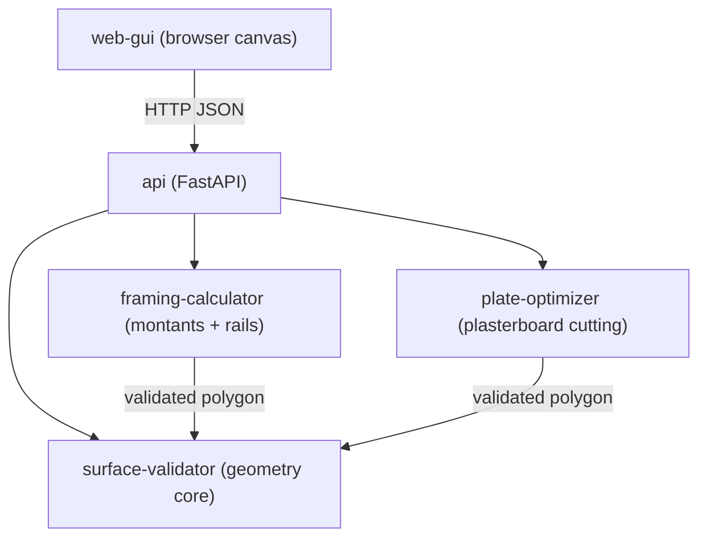

# Architecture

_Last updated: 2026-07-19 — requirement: UI-DRAW-001_

## Overview

`ceiling-planner` computes the material list (rails, studs, plasterboard) for a drop
ceiling from a user-drawn outline. The outline is entered as an ordered sequence of edges
(length + interior angle), not absolute coordinates. A pure-Python geometry core validates
the outline; material calculators consume the resulting polygon; a FastAPI layer exposes
the operations to a browser GUI.

## Component Diagram

## Component Responsibilities

| Component | Responsibility | Requirement(s) |
|-----------|----------------|----------------|
| surface-validator | Convert an ordered edge sequence (length + interior angle) into a polygon and validate it, and derive an edge sequence back from ordered vertices | FUNC-SURFACE-INPUT-001, FUNC-SURFACE-FROMPOINTS-001 |
| framing-calculator | Compute the montant (stud) and rail layout for a self-supporting ceiling from a validated polygon, and select the montant section from the required span | FUNC-FRAMING-MONTANTS-001, FUNC-FRAMING-RAILS-001, FUNC-FRAMING-SECTION-001 |
| api | Expose the `/plan` and `/edges` endpoints over HTTP and serve the web page; map domain errors to responses | TECH-API-PLAN-001, FUNC-SURFACE-FROMPOINTS-001, UI-SCHEMA-001 |
| web-gui | Browser page and canvas to draw or enter the outline and render the plan schema | UI-SCHEMA-001, UI-DRAW-001 |
| plate-optimizer | Optimize plasterboard cutting from a validated polygon | FUNC-PLATE-OPTIM-001 |

## Dependency Injection Map

| Component | Receives | Interface | Requirement |
|-----------|----------|-----------|-------------|
| _(none yet)_ | | | |

_No interface-based injection exists yet. `surface-validator` is a standalone unit that
receives the closure tolerance as a plain parameter. `framing-calculator` consumes a
`Polygon` value produced by `surface-validator` and receives the spacing as a plain
parameter — no interface boundary is crossed, so no DI constraint (and no TECH requirement)
applies yet._

## Requirement → Component Traceability

| Requirement | Component(s) | Notes |
|-------------|-------------|-------|
| FUNC-SURFACE-INPUT-001 | surface-validator | entry point for outline validation |
| FUNC-SURFACE-FROMPOINTS-001 | surface-validator, api | derives edges from drawn vertices; exposed at POST /edges |
| FUNC-FRAMING-MONTANTS-001 | framing-calculator | consumes a validated polygon; produces the montant cut list |
| FUNC-FRAMING-RAILS-001 | framing-calculator | consumes a validated polygon; produces the rail cut list |
| FUNC-FRAMING-SECTION-001 | framing-calculator | selects the montant section from the required span |
| FUNC-PLATE-OPTIM-001 | plate-optimizer | consumes a validated polygon; produces the plate count with offcut reuse |
| TECH-API-PLAN-001 | api | composes validator + framing + plates behind POST /plan |
| UI-SCHEMA-001 | web-gui, api | page served by api; canvas renders the plan schema |
