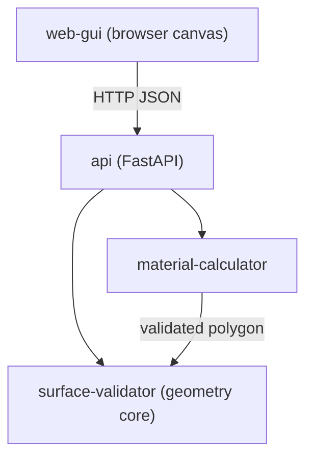

# Architecture

_Last updated: 2026-07-18 — requirement: FUNC-SURFACE-INPUT-001_

## Overview

`ceiling-planner` computes the material list (rails, studs, plasterboard) for a drop
ceiling from a user-drawn outline. The outline is entered as an ordered sequence of edges
(length + interior angle), not absolute coordinates. A pure-Python geometry core validates
the outline; material calculators consume the resulting polygon; a FastAPI layer exposes
the operations to a browser GUI.

## Component Diagram

## Component Responsibilities

| Component | Responsibility | Requirement(s) |
|-----------|----------------|----------------|
| surface-validator | Convert an ordered edge sequence (length + interior angle) into a polygon and validate it (edge count, positive length, angle range, simplicity, closure) | FUNC-SURFACE-INPUT-001 |
| api | Expose validation and material operations over HTTP; map domain errors to responses | _(none yet)_ |
| web-gui | Browser canvas to enter and edit the edge sequence and display the outline | _(none yet)_ |
| material-calculator | Compute rails, studs, and optimized plasterboard from a validated polygon | _(none yet)_ |

## Dependency Injection Map

| Component | Receives | Interface | Requirement |
|-----------|----------|-----------|-------------|
| _(none yet)_ | | | |

_No interface-based injection exists yet. `surface-validator` is a standalone unit that
receives the closure tolerance as a plain parameter._

## Requirement → Component Traceability

| Requirement | Component(s) | Notes |
|-------------|-------------|-------|
| FUNC-SURFACE-INPUT-001 | surface-validator | entry point for outline validation |
